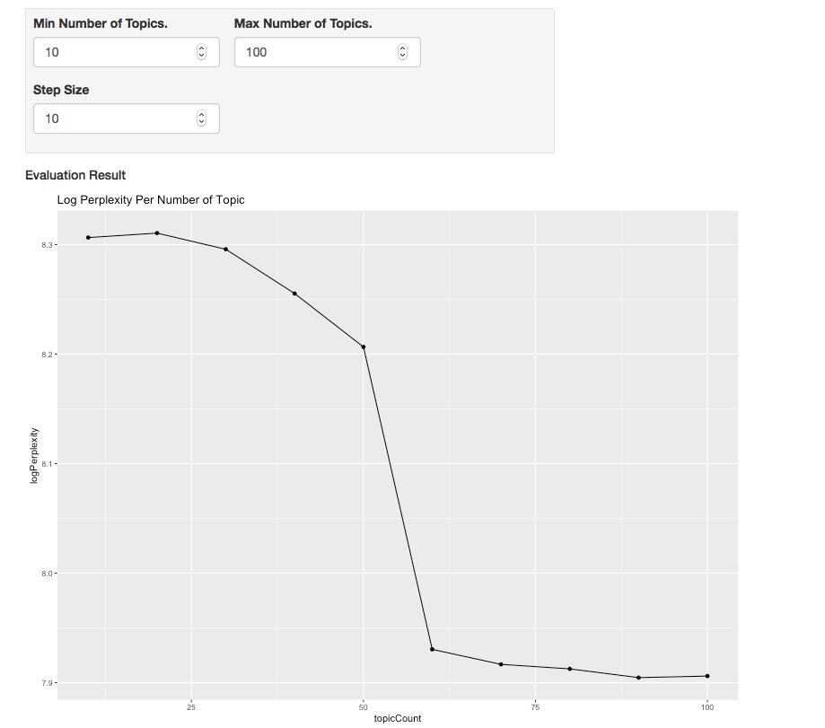

# Explore Topics Prototype

The intention of this prototype is to investigate the assembly of a number of public domain techniques in the area of topic analysis for text corpus within a pipeline of text analysis that occurs after the corpus of text has been collected. This consists of

1. A discovery process - assisted by an unsupervised modelling technique for document topic discovery.
2. A review and curation process - where the user manually reviews metrics for each of the terms and clusters and assigns class labels to clusters.
3. A supervised modelling process - where the user is able to build a classification model derived from the curated data sets defined during the process.

The methods applied in this process are provided by work provided within the public domain, these methods are

- TFIDF document term feature encoding. Provided by the "tidytext" library.
- Latent Dirichlet Allocation. Provided by the "topicmodels" library.
- A feed forward neural network. Provided by the "keras" package for R using a tensorflow backend.

The process overview can be described as follows.

A prototype UI combining a number of techniques to explore topics from within a corpus of short text examples. This leverages the tidyr tools available within R
to provide a simple workflow of

1. Loading Data

2. Assess perplexity of N Topics

3. Exploring N Topics and the Top N Terms per topic.

4. Comparing the Top N Terms in each topic by their log odds ratio with other topics.

5. Manually assigning new labels to topics after review.

6. Allocate documents to topics based on the maximum probability for each topic weighted by the model.

7. Interactively enter new examples to review their topic assignments.

8. Train supervised classifier to label document examples against the generated topics. 

9. Interactively enter new examples to review the topics assigned by the supervised classifier.

## Loading Data

The data is expected in a CSV format containing headers. Documents are expected as short documents (rather than long textual passages). At least one column containing the text is expected. Optional columns are allowed for row identifiers and previously assigned labels.

## Assess Perplexity of N Topics

The choice of the number of topics to generate can be based on some preexisting knowledge, or data collection method. Or otherwise, based on a measure of how well the topics describe the documents given the set of terms in the model.

The measure of perplexity is one heuristic approach to determining whether the number of topics in a model can allocate the documents to a given topic without too much "surprise" (or high degree of entropy). 

In this screen the user is able to enter the starting number of topics, the maximum number of topics and a step size. After which a successive series of lda models are constructed and perplexity for each model is calculated. This information is presented in a plot and a table giving the log of the perplexity for each model. The choice of how many models to use should favour those with lower values for the perplexity measure.

This process takes a fair bit of time to run, so is an optional step, but is worthwhile dedicating some time to perform the processing at an early stage in the process and capturing the results. It can be skipped in subsequent sessions.

In the example image, the choice of 60 or so topics appears to be the best choice, it is then possible to narrow in on this range and repeating the analysis.

## Exploring Topics.

After the document is loaded, a topic model is generated using the LDA algorithm provided by the tidyr textmining tools. The user may elect the number of topics and can review the top terms for each topic, 10 topics at a time. To allow some sense of the highly ranked words that are associated with each topic. It is possible to enter a value for the number of words to include in the top terms list. This provides the opportunity to review the potential subject for each of the topics based on the most probable words for that group.

## Review Log odds ratio

The log odds ratio of the top terms in a selected topic, versus the same terms in other topics, can give a sense as to whether a term is unique to a chosen topic versus its use in the other topics. Those terms having a log odds ratio close to 0 are common between the selected topic and the others. Whereas those having large magnitude values (either negative or positive) are unique largely to the selected topic. The user can compare from the perspective of a chosen topic and visually review the log odds ratio. The use of the this screen is intended to help the user decide which words are influential and distinct to a given topic. This can help to inform the choice of meanings to assign when manually relabelling topics. 

