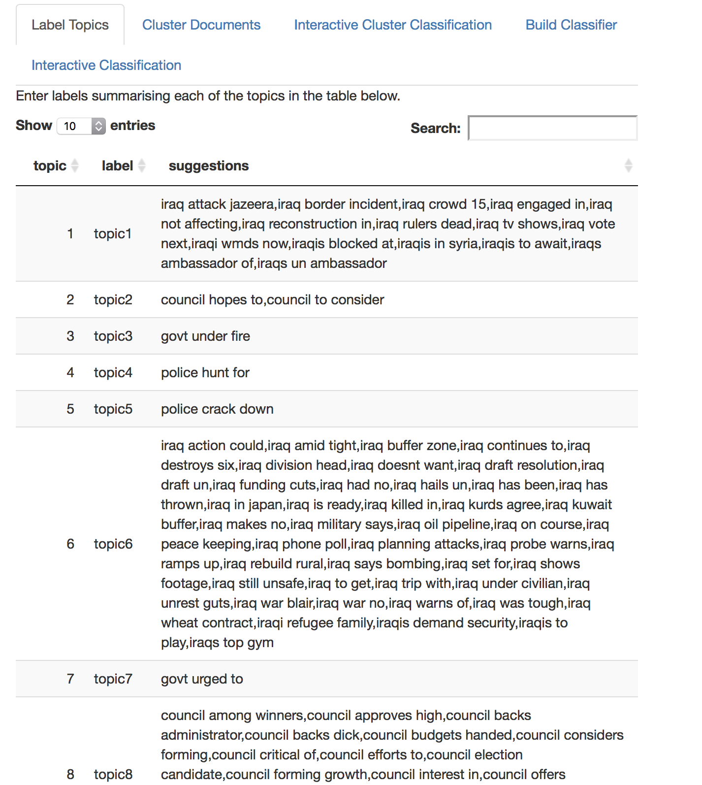

# Explore Topics Prototype


The intention of this prototype is to assemble a user interface implementation of a pipeline for topic analysis. The prototype makes use of a number of a number of public domain techniques. The focus of the user interface consists of

1. A discovery process - assisted by an unsupervised modelling technique for document topic discovery.
2. A review and curation process - where the user manually reviews metrics for each of the terms and clusters and assigns class labels to clusters.
3. A supervised modelling process - where the user is able to build a classification model derived from the curated data sets defined during the process.

The methods applied in this process are:

- TFIDF document term feature encoding. Provided by the "tidytext" library.
- Latent Dirichlet Allocation. Provided by the "topicmodels" library.
- A feed forward neural network. Provided by the "keras" package for R using a tensorflow backend.

The process overview is shown in the following diagram. 

The diagram illustrates four broad concerns, whereas the prototype encapsulates only two areas of focus indicated by the two central panels within the dotted line. 


The two areas that are not encapsulated by the prototype include:

- External Collection
- External Deployment

External Collection will be concerned with the processes and systems required for the collection of textual data and the arrangement of that data in a format that is suitable for loading into the system.

The External Deployment partition is concerned with the processes required for operationalising the models that are produced as an output of the modelling activity, such as within a service component. Applications of such a service may include the categorisation of new examples of text in terms of the topics that have been identified and labelled. As well as providing a means of accessing the collective corpus through the same categories. This is the partition concerned with "application" of the models.

The prototype is not concerned directly with either of these, it is instead concerned with the activities involved in topic modelling, description (curation) and discriminative models using either the LDA model directly or using a supervised learning method on the labelled corpus to train a simple feedforward network classifier.

These are represented by the two partitions:

- Topic Modelling Process
- Supervised Modelling Process

The topic modelling process, in this prototype, is concerned largely with exploration, review and curation, but also produces an artefact that can be used to classify new examples as a result of the LDA model.
The supervised modelling process makes use of the curated data set, which results from the manual labelling assigned to topics, and used as labels for the outputs of document clusters, generated by the assignment of documents to their most closely related topic. This data is then used as the data set that is partitioned for the training process of the feedforward network.  

The type of text that is the focus of the process consists of short sentences rather than entire documents. This type of data is found in such domains as chat, social media, news headlines, speech systems and in descriptions annotating transactions. The data is suitable for such activities as categorising media, identifying sentiment or common meaning, and clustering similar examples. 

A prototype UI leverages the tidyr tools available within R to provide a simple workflow of

1. Loading Data from CSV

2. Assess perplexity of N Topics

3. Generating a Model of N Topics

3. Exploring the Top Terms per topic (review process).

4. Comparing the Top Terms in each topic by their log odds ratio with other topics (review process).

5. Manually assigning new labels to topics after review (curation).

6. Allocate documents to topics based on the maximum probability for each topic weighted by the model (clustering).

7. Interactively enter new examples to review their topic assignments.

8. Train supervised classifier to label document examples against the generated topics. 

9. Interactively enter new examples to review the topics assigned by the supervised classifier.


## Loading Data

The data is expected in a CSV format containing headers. Documents are expected as short documents (rather than long textual passages). At least one column containing the text is expected. Optional columns are allowed for row identifiers and previously assigned labels.

The format for example is to have at least one column containing text, an optional column for document ids as well as optional columns for any existing labels. The columns in the csv would be defined as below for example:

```
  docid                                             text label
1     1  police confused over police chase lingo coroner topic1
2     2                      us open course hole by hole topic6
3     3 from royal performance to royal resort for title topic4
4     4     nsw govt considers local govt reform options topic6
5     5   consumers warned to be wary after door to door topic9
6     6                      world cup eyes disney world topic1
```

This data example is drawn from a set of headlines associated with ABC news article headlines, the objective of the topic analysis would be to define a topic model that is able to categorise existing headlines and can be applicable to new news headlines. 

The subset of 10000 examples can be found here [ABC News Subset](data/ABC_news_example/export_10_clusters.csv).


## Assess Perplexity of N Topics

The choice of the number of topics to generate could be based on some preexisting knowledge, or data collection method. Or otherwise, based on a measure of how well the topics describe the documents given the set of terms in the model.

The measure of perplexity is one heuristic approach to determining whether the number of topics in a model can allocate the documents to a given topic without too much "surprise" (or high degree of entropy). 

In this screen the user is able to enter the starting number of topics, the maximum number of topics and a step size. After which a successive series of lda models are constructed and perplexity for each model is calculated. This information is presented in a plot and a table giving the log of the perplexity for each model. The choice of how many models to use should favour those with lower values for the perplexity measure.

This process takes a fair bit of time to run, so is an optional step, but is worthwhile dedicating some time to perform the processing at an early stage in the process and capturing the results. It can be skipped in subsequent sessions.


In the example image, the choice of 200 or so topics for the data set appears to be the best choice, it is then possible to narrow in on this range and repeating the analysis.

## Exploring Topics.

After the document is loaded, a topic model is generated using the LDA algorithm provided by the tidyr textmining tools. By and large the prototype follows the procedure defined in the "Tidy Test Mining" website from the chapter on topic modelling, [Topic Modelling with Tidy Text](https://www.tidytextmining.com/topicmodeling.html). 

The user may elect the number of topics and can review the top terms for each topic, 10 topics at a time. To allow some sense of the highly ranked words that are associated with each topic. It is possible to enter a value for the number of words to include in the top terms list. This provides the opportunity to review the potential subject for each of the topics based on the most probable words for that group.


Once the model has been generated it is possible to download the model using the "Download LDA Model" button. The resulting zip file also be uploaded on the previous screen so as to avoid having to rebuild the model multiple times (shown in the screenshot below). Especially where the input data is a large file and the original process of building the model takes a long time.


## Review Log odds ratio

The log odds ratio of the top terms in a selected topic, versus the same terms in other topics, can give a sense as to whether a term is unique to a chosen topic versus its use in the other topics. Those terms having a log odds ratio close to 0 are common between the selected topic and the others. Whereas those having large magnitude values (either negative or positive) are unique largely to the selected topic. The user can compare from the perspective of a chosen topic and visually review the log odds ratio. The use of the this screen is intended to help the user decide which words are influential and distinct to a given topic. This can help to inform the choice of meanings to assign when manually relabelling topics. 


## Labelling Topics

The review phase is intended to assist the user to assign labels to each of the topics that are produced from the LDA procedure. The end user makes use of the top terms, their respective mappings between topics given the log ratio, and a set of suggestions shown in the table associated with the labels.



The suggestions column is produced through the top most frequent trigrams associated with the most probable term occuring within each topic. The user may switch between screens to make decisions about the descriptions they choose to enter. Once completed it is possible to export a csv of labels which can be loaded in subsequent iterations. This can be useful where there are a large number of topics to assign, and the process may be applied over several separate sessions working with the UI.


## Cluster DOcuments

Once the labels have been assigned to each topic, the original data set may be clustered and each individual document is assigned a corresponding label against the topic that has the maxmimum probability given the document. This can serve as a method of exploring the document set further.


The populations for each cluster are also shown on the same page to give the user an idea of how representative each of the clusters are within the data set.


The resulting documents are a labelled data set, which have been assigned the labels manually defined for each topic. This data set can then be exported as CSV and reused in other processes.


## Interactive Classification using the LDA Model.

The LDA model can be used to predict the most appropriate topics given a new example, the interactive screen allows the user to experiment with the process, and to review the ranking of topics that are assigned the example that they enter. 


Additionally the other documents associated with the same topic are shown on the same page.


## Training the Network Classifier.

The prototype provides a means of training a feedforward network using the labelled document set. The target variable is the label assigned to the documents. Once trained the UI also allows the model to be exported for reuse in other contexts. The model is a tensorflow library and the two export options allow exporting as a hdf5 file along with corresponding training data (serialised as an R data type), or as a frozen tensor flow model.


Once the training is complete the model training history for training and validation is displayed in graphical form and reported in tabular form.


The model is also evaluated against the test set partition (the percentage for the partition sizes is defined at the top of the screen). The test outcome is presented at the bottom of the page below the training results. Note also the tensorflow ui is started on the port specified in the options at the top of the page.


## Running the Prototype.

The prototype is written in the R Shiny framework, and executes via the "runApp()" method of that library from within the base directory of the project.

The dependencies for the project may be installed via the "dependencies.R" script. When installing keras ensure to first install the tensorflow environment.


